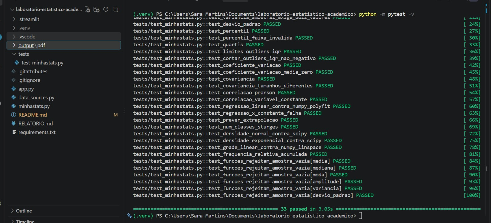

# Laboratório Estatístico Interativo

**Disciplina:** Matemática e Estatística para Computação
**Integrante:** Sara Martins Oliveira de Sousa — RA 72650204

Aplicação web em Python e Streamlit que transforma um conjunto de dados real em um
laboratório interativo de estatística. O foco do projeto é implementar os cálculos
fundamentais em uma biblioteca própria (`minhastats.py`) e validá-los contra
referências consolidadas (NumPy/SciPy), sem que a interface dependa dessas
bibliotecas para exibir nenhum resultado.

## Dataset

O projeto utiliza exclusivamente o dataset público
[Bank Marketing — UCI Machine Learning Repository](https://archive.ics.uci.edu/dataset/222/bank%2Bmarket).
A base reúne **45.211 registros**, sete variáveis numéricas e dez variáveis
categóricas sobre campanhas de marketing bancário por telefone. O download é
feito diretamente da fonte oficial, sem cópia local do CSV (`data_sources.py`).
Se o download falhar (ex.: sem internet), a aplicação avisa claramente na tela
e usa uma amostra simulada apenas para não travar a demonstração.

## Regra de ouro do projeto

**Toda medida estatística exibida na tela vem das funções escritas à mão em
`minhastats.py`.** NumPy e Pandas aparecem apenas para carregar, filtrar e
amostrar a tabela — nunca para calcular média, mediana, variância, percentil,
correlação, regressão, densidade de probabilidade etc. Essa separação é
verificada nos testes automatizados (`tests/test_minhastats.py`), que comparam
cada função com NumPy/SciPy usando tolerância numérica documentada.

## Funcionalidades

- **Dados reais:** carregamento reproduzível da fonte oficial UCI.
- **Núcleo estatístico próprio:** média, mediana, moda, amplitude, variâncias
  (amostral/populacional), desvios-padrão, percentis, quartis, coeficiente de
  variação, covariância, correlação de Pearson, regressão linear (mínimos
  quadrados), regra de Sturges, densidades Normal e Exponencial.
- **Descritiva (Módulo 2):** tabelas de frequências, histogramas com nº de
  classes calculado pela regra de Sturges, boxplots, gráficos de barras/pizza,
  detecção de outliers pelo IQR e interpretação automática de assimetria.
- **Simulações (Módulo 3):** Lei dos Grandes Números e Teorema Central do
  Limite, com parâmetros controláveis pelo usuário.
- **Distribuições (Módulo 4):** comparação visual da variável escolhida com as
  curvas teóricas Normal e Exponencial, com discussão honesta de quando o
  ajuste falha.
- **Regressão (Módulo 5):** dispersão, reta de mínimos quadrados, equação,
  Pearson, R², aviso fixo de que correlação não implica causalidade e
  predição interativa travada ao intervalo observado (sem extrapolação).
- **Descobertas (Módulo 6):** três achados sobre adesão, duração das chamadas
  e histórico de campanhas anteriores.

## Estrutura do repositório

```
app.py                    # Interface Streamlit e visualizações
minhastats.py             # Núcleo matemático implementado pela autora
data_sources.py           # Carregamento do dataset oficial (UCI)
tests/test_minhastats.py  # Validação automatizada contra NumPy/SciPy
RELATORIO.md              # Relatório técnico da atividade
ROTEIRO_VIDEO.md          # Roteiro do vídeo de apresentação
requirements.txt          # Dependências para reprodução
```

## Como executar

Pré-requisito: Python 3.10 ou superior.

```
python -m venv .venv
.\.venv\Scripts\Activate.ps1        # Windows (PowerShell)
# source .venv/bin/activate         # Linux/Mac
python -m pip install -r requirements.txt
streamlit run app.py
```

Após o comando, abra no navegador o endereço apresentado pelo Streamlit,
normalmente `http://localhost:8501`.

## Como validar os cálculos

```
python -m pytest -v
```

Os testes comparam os resultados de `minhastats.py` com NumPy e SciPy, usando
tolerância relativa (`rtol`) documentada em cada teste — de `1e-9` para somas
e médias a `1e-6` para percentis, onde pequenas diferenças de arredondamento
são esperadas.

## Capturas de tela

### 1. Visão Geral dos Dados


### 2. Estatística Descritiva

.png)
.png)
.png)

### 3. Simulações e Teorema Central do Limite

.png)

### 4. Ajuste de Distribuições


### 5. Regressão e Correlação


### 6. Conclusões e Descobertas

.png)
.png)

### 7. Validação e Testes
