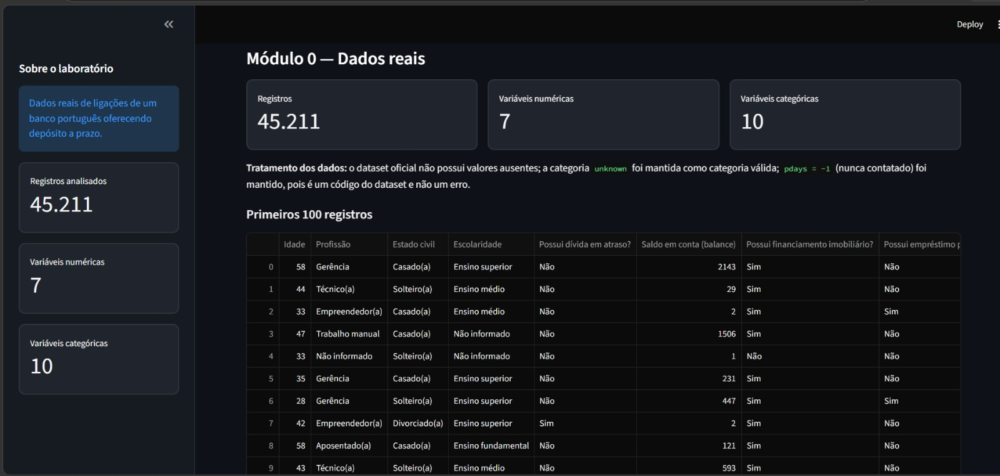
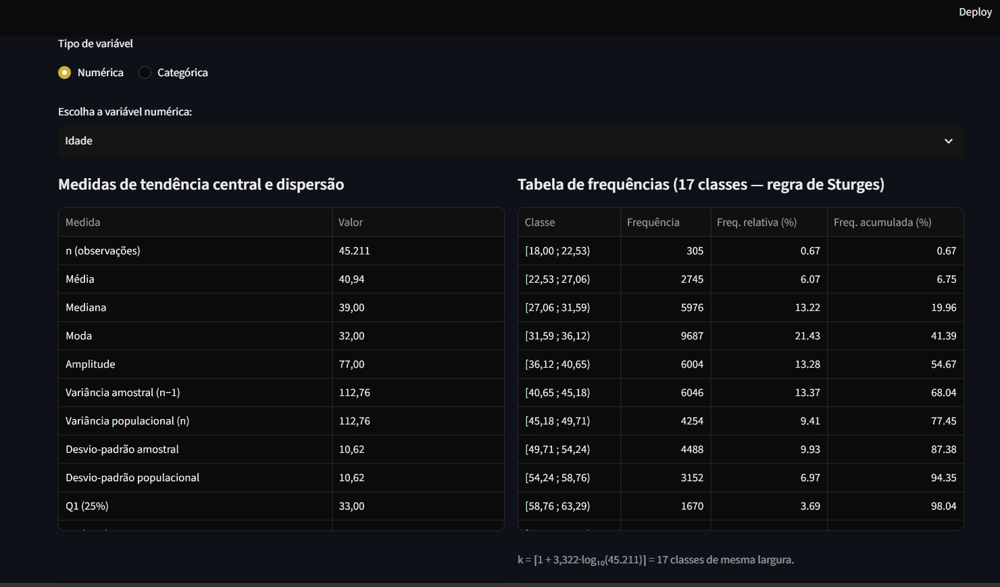
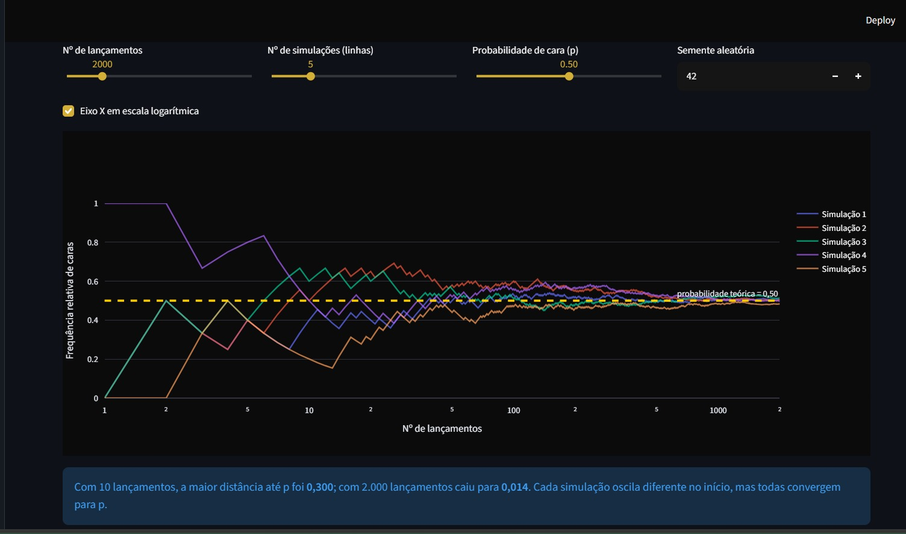
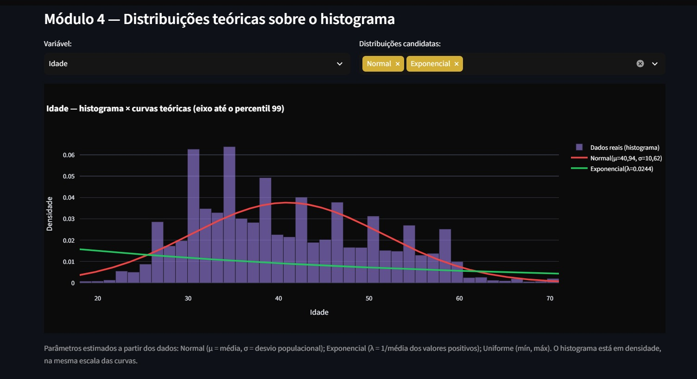
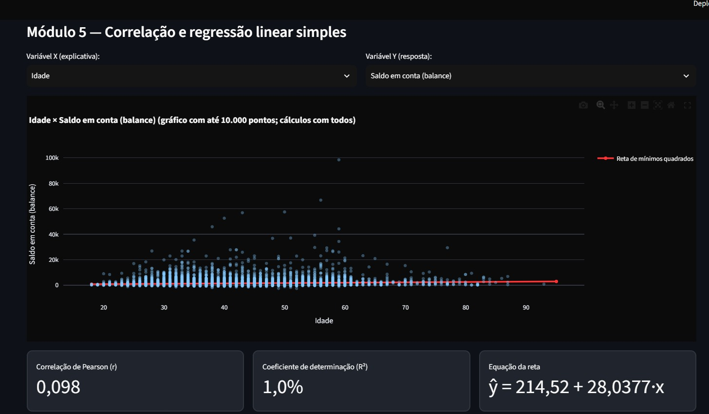
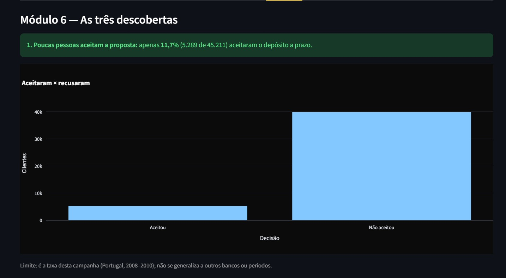

# Laboratório Estatístico Interativo

**Disciplina:** Matemática e Estatística para Computação
**Integrante:** Sara Martins Oliveira de Sousa — RA 72650204
**Vídeo de demonstração:** https://youtu.be/QshIyZCvTrk

Aplicação web em Python e Streamlit que transforma um conjunto de dados real em um laboratório interativo de estatística. O núcleo matemático (`minhastats.py`) foi implementado do zero, em Python puro, e validado por testes automatizados contra NumPy e SciPy. **Todas as medidas exibidas na interface vêm dessa biblioteca própria.**

## Dataset

[Bank Marketing — UCI Machine Learning Repository](https://archive.ics.uci.edu/dataset/222/bank%2Bmarketing): **45.211 registros**, 7 variáveis numéricas e 10 categóricas (incluindo o alvo `y`) sobre campanhas de telemarketing de um banco português (2008–2010).

## Módulos

| Módulo | O que faz |
|---|---|
| 0 — Dados | Carrega o dataset oficial da UCI e documenta o tratamento. |
| 1 — Núcleo (`minhastats.py`) | Média, mediana, moda, amplitude, variância e desvio-padrão (amostral e populacional), percentis/quartis, CV, covariância, Pearson, regressão por mínimos quadrados, assimetria, tabela de frequências (Sturges), IQR, densidades Normal/Exponencial/Uniforme. |
| 2 — Descritiva | Tabela de frequências por classes (Sturges), medidas, histograma, boxplot, outliers (IQR) e interpretação textual automática. |
| 3 — Simulação | Lei dos Grandes Números e Teorema Central do Limite (sobre variável do dataset), com controle de n, repetições, p e semente. |
| 4 — Distribuições | Normal, Exponencial e Uniforme sobre o histograma, com parâmetros estimados dos dados, erro de ajuste e discussão automática. |
| 5 — Regressão | Dispersão, reta, equação, r, R², interpretação dos coeficientes, alerta de causalidade, predição com aviso de extrapolação e matriz de correlação. |
| 6 — Descobertas | Três descobertas sustentadas por números e gráficos da própria aplicação. |

## Estrutura do repositório

```
app.py                    # Interface Streamlit (só apresenta; calcula via minhastats)
minhastats.py             # Núcleo matemático em Python puro
data_sources.py           # Carregamento do dataset oficial
tests/test_minhastats.py  # 42 testes comparando com NumPy/SciPy
RELATORIO.md              # Relatório técnico
ROTEIRO_VIDEO.md          # Roteiro do vídeo
requirements.txt          # Dependências
docs/screenshots/         # Capturas de tela da aplicação
```

## Como executar

Pré-requisito: Python 3.10 ou superior.

```bash
python -m venv .venv
# Windows (PowerShell): .\.venv\Scripts\Activate.ps1
# Linux/macOS:          source .venv/bin/activate
python -m pip install -r requirements.txt
streamlit run app.py
```

Abra o endereço mostrado pelo Streamlit (normalmente `http://localhost:8501`).

## Como validar os cálculos

```bash
python -m pytest -v
```

Os testes comparam `minhastats.py` com NumPy, SciPy e cálculos de referência. Tolerâncias: `rtol=1e-9` para médias, variâncias e densidades; `rtol=1e-6` para percentis, covariância, correlação e regressão. A diferença observada é da ordem de 1e-14 a 1e-16 (arredondamento de ponto flutuante).

## Evidências da aplicação

| | |
|---|---|
|  |  |
|  |  |
|  |  |

## Entrega

Relatório técnico: [RELATORIO.md](RELATORIO.md).
